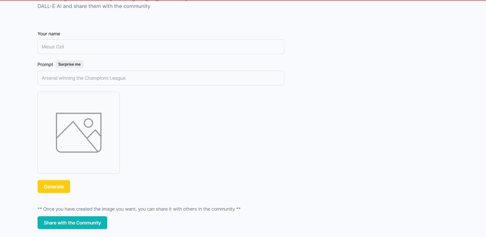
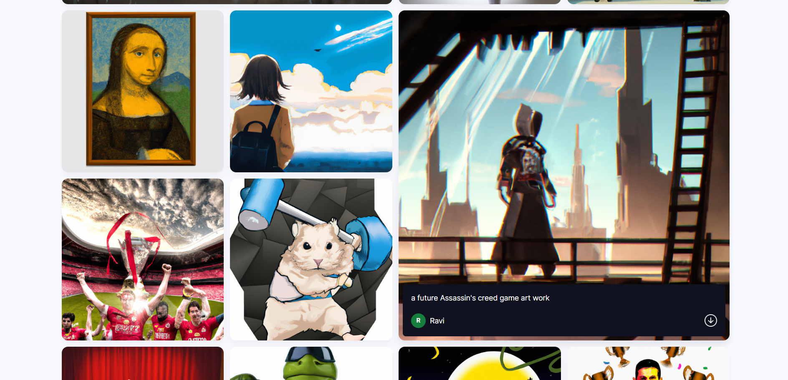
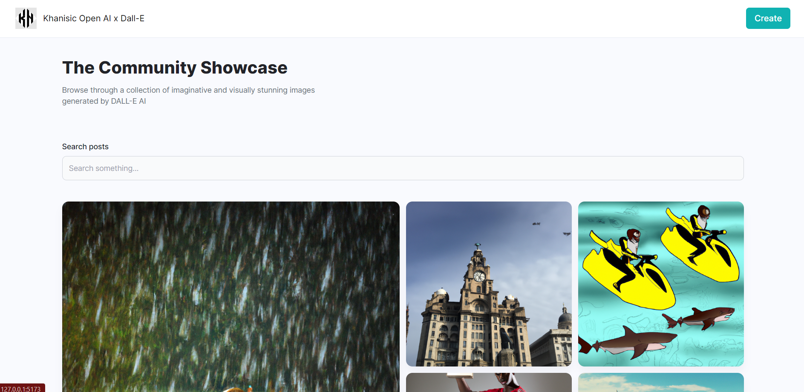

# Dall - E, MERN application

<p>Hey guys, Khanisic/Abdul Moid Khan here 👋.</p>
<br/>
<p>Welcome to the Dall-e MERN application where you can generate your ideas and watch the DALL-E API do its magic. Here, you can share your images without having to create an account and view other creators ideas as well.</p>
<br/>
<p>I have used <i>Next.js - A fullstack react framework,</i> to build the project deployed it on vercel. For the backend, I've used MongoDB and used express to power the server.</p>
<hr/>
<br/>
<p>Screenshots:</p>




<br/>
Steps to install:

1.Go into the client directory:

```shell
cd client
```

2.Run the npm install command.

```shell
npm install
```

3.After the dependencies have been installed, run the build command.
```shell
npm run dev
```

4.Then go to http://127.0.0.1:5173 to see the application.

<p>Thank You ❤️</p>